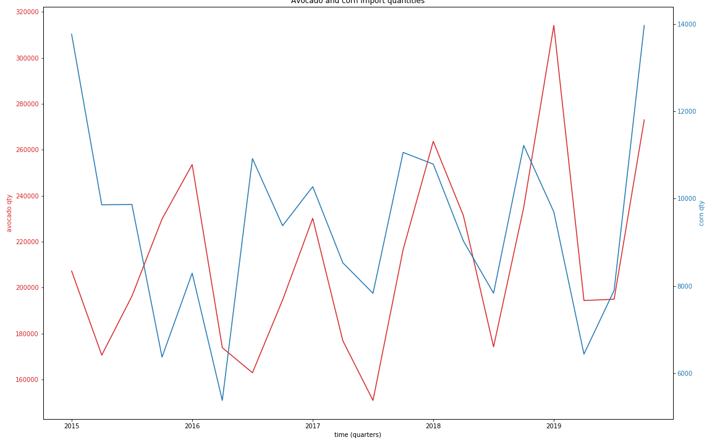
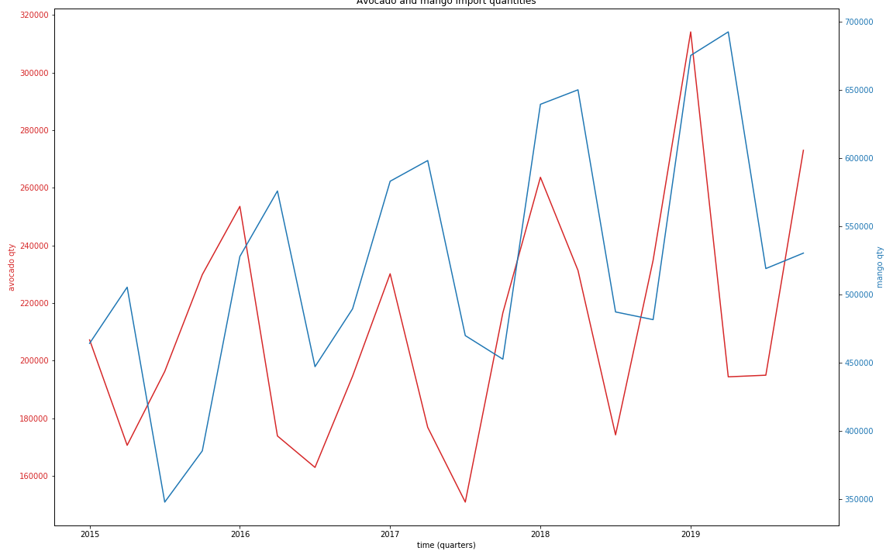
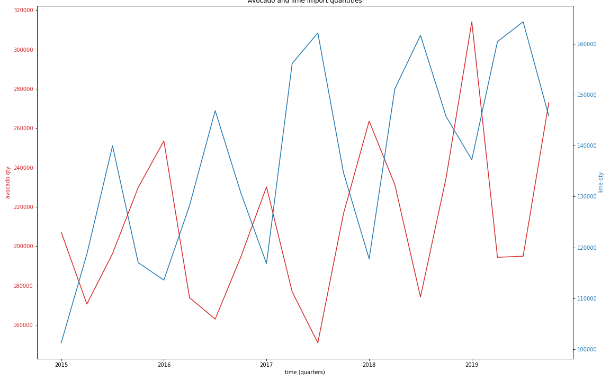
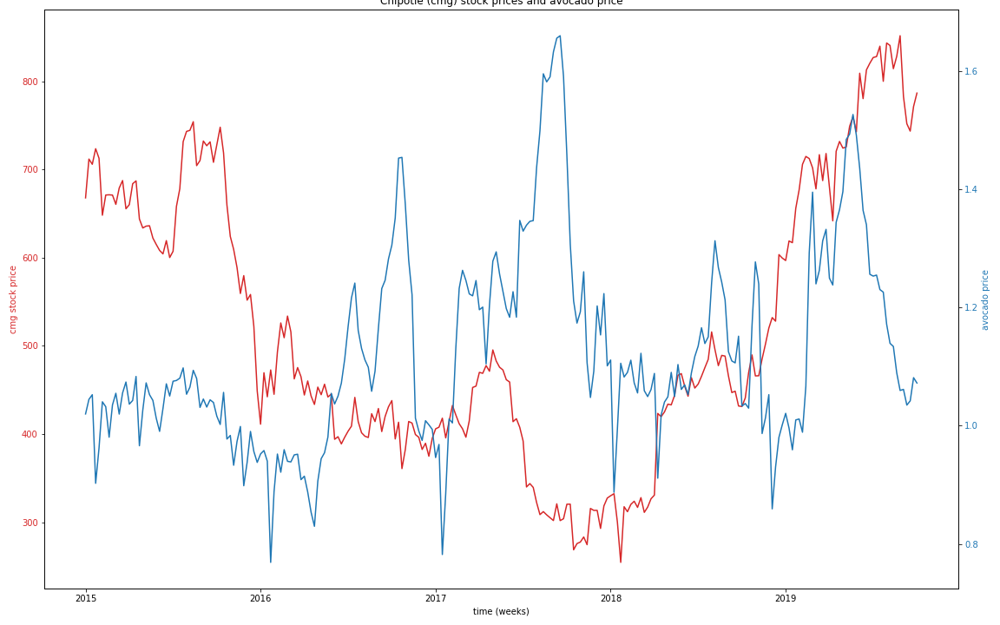
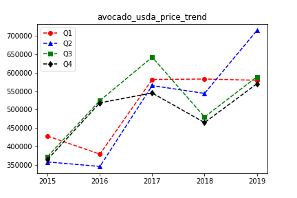
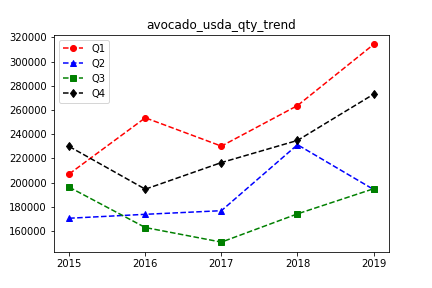

# Avocado_Project

## Key Questions

1. Did increasing avocado prices cause avocado imports to increase and imports of other crops produced in Michoacan to decrease (Kaggle and USDA)?
2. As prices went up how did domestic and import amount change (USDA)?
3. Does the time of year affect the price of avocados?
4. Does the pric of avocados affect the stock price of Chipotle?

## Data sources

We used an avocado price data set from Kaggle (CSV), Yahoo Finance API for Chipotle stock price, and United States Department of Agriculture Foreign Agricultural Service data (CSV)

## Summary

1. We did not see any obvious change to the production of other crops as avocados ramped up.

2. Yet to be determined import/dometic production relation.
3. There was a dip in avocado prices near the beginning of the year for four of the five years considered.
4. There was a significant drop to Chipotle stock in one case where avocado prices shot up.

## ETL Steps

1. FSDA data was in a two way table. Used iloc to change to one way (See Below).
2. Yahoo finance API gave daily stock close values, but the Kaggle data was weekly (Sunday). The last day of the weeks close for Chipotle was used for price on Sunday.
3. All data was imported into SQL tables and querried later to make plots.
4. Various conversions to date format and numeric format after removing comma-like charecter from numbers (used to compute unit prices).

### Before:

|FIELD1|Partner|FIELD3|HS Code  |Product         |Year     |UOM|Q1(Jan-Mar) Value|Q1(Jan-Mar) Qty|Q2(Apr-Jun) Value|Q2(Apr-Jun) Qty|Q3(Jul-Sep) Value|Q3(Jul-Sep)Qty|Q4(Oct-Dec) Value|Q4(Oct-Dec) Qty|Total Value|Total Qty |Reporter Code|Partner Code|Product Code|
|------|-------|------|---------|----------------|---------|---|-----------------|---------------|-----------------|---------------|-----------------|--------------|-----------------|---------------|-----------|----------|-------------|------------|------------|
|1     |Mexico |1     |805503000|LIM,TAH/PR,FR/DR|2015-2015|MT |82,086           |101,270.30     |70,518           |118,700.50     |65,554           |139,964.90    |52,877           |117,020.30     |271,035    |476,955.90|US           |MX          |805503000   |
|1     |Mexico |1     |805503000|LIM,TAH/PR,FR/DR|2016-2016|MT |70,928           |113,589.30     |126,874          |128,207.70     |81,396           |146,864.20    |69,181           |130,708.00     |348,379    |519,369.10|US           |MX          |805503000   |
|1     |Mexico |1     |805503000|LIM,TAH/PR,FR/DR|2017-2017|MT |111,125          |116,851.50     |85,032           |156,135.40     |87,353           |162,139.10    |84,084           |134,692.20     |367,594    |569,818.20|US           |MX          |805503000   |
|1     |Mexico |1     |805503000|LIM,TAH/PR,FR/DR|2018-2018|MT |140,423          |117,758.60     |127,912          |151,146.10     |93,635           |161,657.10    |73,466           |145,703.10     |435,436    |576,265.00|US           |MX          |805503000   |
|1     |Mexico |1     |805503000|LIM,TAH/PR,FR/DR|2019-2019|MT |113,771          |137,236.80     |119,491          |160,433.30     |119,449          |164,323.60    |100,280          |145,816.10     |452,990    |607,809.90|US           |MX          |805503000   |

### After:

|FIELD1|year  |quarter|value    |qty             |price    |
|------|------|-------|---------|----------------|---------|
|0     |2015  |1      |892426   |464327.1        |1.9219769856206972|
|1     |2015  |2      |761529   |505477.0        |1.5065551944005364|
|2     |2015  |3      |440088   |348003.2        |1.2646090610661052|
|3     |2015  |4      |739714   |385540.0        |1.9186439798723869|
|4     |2016  |1      |1046512  |527981.1        |1.9821012532456181|
|5     |2016  |2      |903974   |575985.6        |1.5694385415190937|
|6     |2016  |3      |536917   |447233.5        |1.2005294773311928|
|7     |2016  |4      |891793   |489631.9        |1.8213539599850417|
|8     |2017  |1      |1149175  |583105.6        |1.9707836796628262|

## SQL tables

- cmg (Chipotle Stock Price)
- avo_price (Avocado Price Data from Kaggle)
- avo_qtr_price (Average Quarterly Price based on Kaggle Data)
- avocada_fsda (Avocado Import Data)
- corn_fsda (Corn Import Data)
- mango_fsda (Mango Import Data)
- lime_fsda (Lime Import Data)

## File Purpose

All imports are made to create and update SQL tables

|File|Purpose|
|----|-------|
|import_avocado_prices|Import data from Kaggle CSV file|
|chipotle.ipynb|Import data from yahoo finance|
|cmg_analysis_and_plot.ipynb|analyse stock prices and avocado prices|
|import_fas_data|import avocado import data from fsda|
|lime.ipynb|import lime data from fsda|
|mango_df.ipynb|import mango data from fsda|
|analysis_fsda.ipynb|analyze data from fsda|

<!-- 
File,Purpose
import_avocado_prices,Import data from Kaggle CSV file
chipotle.ipynb,Import data from yahoo finance
cmg_analysis_and_plot.ipynb,analyse stock prices and avocado prices
import_fas_data,import avocado import data from fsda
lime.ipynb,import lime data from fsda
mango_df.ipynb,import mango data from fsda
analysis_fsda.ipynb,analyze data from fsda
> 
